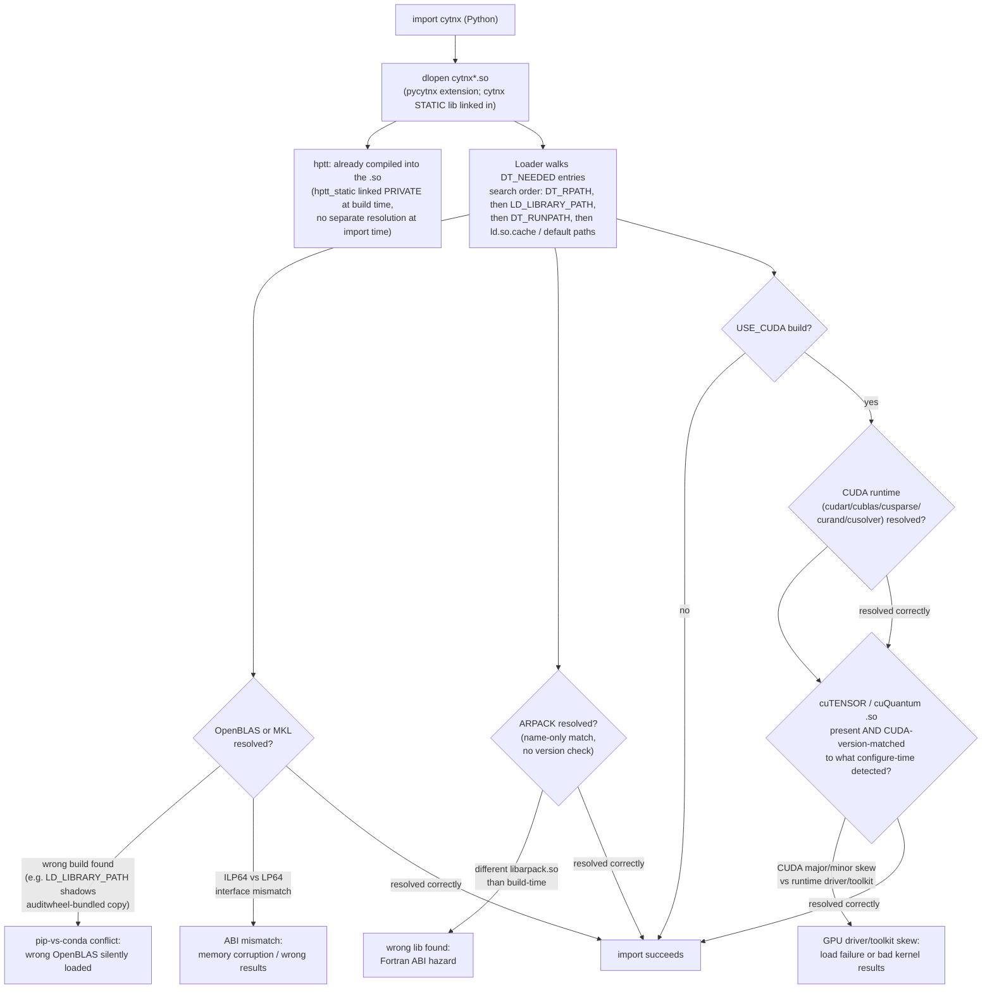

# 03 — Core Problems (one story)

Reference commit: Cytnx `v1.1.0` (`8d96d928d22cc176615e97cafdb7a3cef66cb732`), the read-only submodule at `external/Cytnx`, as in chapters 01–02. Citations are file paths and line numbers inside that submodule unless noted otherwise, checked on 2026-07-03. Chapter 01 established *what* Cytnx builds and ships; chapter 02 established, dependency by dependency, *how hard* each one is to ship. This chapter argues that those two facts are not independent: the way a dependency is *found* at configure time determines, almost mechanically, how fragile it is to *resolve* at `import cytnx` time. Sections 3.1–3.2 walk each half of that mechanism; §3.3 states the connection explicitly; §3.4 diagrams the resolution flow that results.

## 3.1 Build-time discovery

Chapter 02's summary table (ch.02 §2.1) already shows that Cytnx's dependencies are not located by one consistent mechanism — they are located by at least five different mechanisms, coexisting in the same CMake configure pass:

1. **`find_package` against a package-manager-registered config/module** — OpenBLAS/MKL via `find_package(BLAS/LAPACK/LAPACKE REQUIRED)` with `BLA_VENDOR` set beforehand (`external/Cytnx/CytnxBKNDCMakeLists.cmake:7-25` for MKL, `:38-50` for OpenBLAS), Boost via `find_package(Boost REQUIRED)` with no `COMPONENTS` (`external/Cytnx/CMakeLists.txt:266`), pybind11 via `find_package(pybind11 3.0.0 QUIET)` (`external/Cytnx/CMakeLists.txt:377`), and the CUDA toolkit itself via `find_package(CUDAToolkit REQUIRED)` (`external/Cytnx/CytnxBKNDCMakeLists.cmake:138`).
2. **`find_library` by name only, with no `find_package` config at all** — ARPACK: `find_library(ARPACK_LIB arpack REQUIRED)` (`external/Cytnx/CMakeLists.txt:307`). There is no `FindARPACK.cmake` anywhere in the tree; CMake matches whatever file named `libarpack.{so,dylib,a}` sits on the linker's search path, with no version, variant, or ABI metadata consulted.
3. **A required environment variable, validated by a custom find module** — cuTENSOR and cuQuantum. `require_dependent_variable(CUTENSOR_ROOT "$ENV{CUTENSOR_ROOT}" PATH ...)` fails configuration outright if `CUTENSOR_ROOT` is unset whenever `USE_CUTENSOR=ON` (`external/Cytnx/CMakeLists.txt:180-182`); the same pattern gates `CUQUANTUM_ROOT` for `USE_CUQUANTUM` (`external/Cytnx/CMakeLists.txt:183-186`). The actual library search then happens inside Cytnx's own modules, `external/Cytnx/cmake/Modules/FindCUTENSOR.cmake` and `FindCUQUANTUM.cmake`, which re-validate the root variable and then `find_library(... PATHS ${CUTENSOR_ROOT} NO_DEFAULT_PATH)` (`FindCUTENSOR.cmake:47-60`, `FindCUQUANTUM.cmake:36-49`) — a search confined entirely to a user-supplied path, not the system's normal library search paths.
4. **Vendored source, never searched for at all** — hptt is a git submodule at `thirdparty/hptt`, `add_subdirectory`-ed in-tree (`external/Cytnx/CytnxBKNDCMakeLists.cmake:62-103`, already detailed in ch.02 §2.2); there is no `find_package(hptt)` path even though a conda-forge `hptt` package exists (ch.02 §2.2).
5. **Shell subprocess introspection of a live Python environment** — the `BACKEND_TORCH` path shells out via `execute_process` to `python -c 'import torch; print(torch.utils.cmake_prefix_path)'` before calling `find_package(Torch REQUIRED)` (`external/Cytnx/CMakeLists.txt:280-288`); the discovery mechanism itself depends on whatever `torch` happens to be importable in the configuring Python interpreter, not on any CMake-visible version constraint.

**Why this hurts reproducibility.** `CMakePresets.json` fixes the *combination* of `USE_*` options (ch.01 §1.1: `openblas-cpu`, `mkl-cpu`, `openblas-cuda`, `mkl-cuda`, `openblas-apple`), but a preset name is not a pin on *which physical library file* each enabled option resolves to. Two configure runs of the identical `openblas-cuda` preset, on two machines (or the same machine on two days) with different `PATH`/`LD_LIBRARY_PATH`/`MKLROOT`/`CUTENSOR_ROOT`/`CUQUANTUM_ROOT` values, can silently link against different OpenBLAS builds, different CUDA toolkit minor versions, or different cuTENSOR installs — the preset guarantees the *option matrix*, not the *artifact*. This is compounded by the dead-code hazard ch.02 §2.2 already surfaced: `FindCUTENSOR.cmake:65` and `FindCUQUANTUM.cmake:54` set `CUTENSOR_FOUND`/`CUQUANTUM_FOUND` to `TRUE` unconditionally, regardless of whether the `find_library` calls actually succeeded, so `CytnxBKNDCMakeLists.cmake:199-200`/`:217-218`'s `FATAL_ERROR` fallback for "cannot find cutensor/cuquantum" never fires. A misconfigured `CUTENSOR_ROOT` (pointing at a directory that exists but doesn't contain the right `.so`) doesn't stop the build with a clear message at configure time — it produces a build that *reports success* and fails later, either at link time (undefined references) or, if it somehow links against a stale library left over from a previous build in the same directory, at import time with no diagnostic connecting the failure back to its build-time cause. Reproducibility failure here isn't just "a different library got picked" — it can be "no usable library was found, and nothing said so."

**Platform angle.** On Linux, the GPU stack (`USE_CUDA`/`USE_CUTENSOR`/`USE_CUQUANTUM`) is fully implemented in CMake (ch.01 §1.1, ch.02 §2.2) but never exercised by CI (ch.01 §1.2 cross-cutting observation) — so the env-var-gated discovery path in point 3 above is, in practice, always driven by a human's local environment rather than a controlled CI one, which is precisely the discovery mechanism most exposed to machine-to-machine drift. On macOS, CUDA/cuTENSOR/cuQuantum are unreachable at all (NVIDIA dropped macOS CUDA support after 10.2, ch.02 §2.2), so `CMakePresets.json`'s `openblas-apple` preset has no GPU counterpart (ch.01 §1.1) and none of points 3 needs to apply there. What macOS does have is its own discovery inconsistency: `docs/source/adv_install.rst` recommends MKL on Mac because a plain Homebrew `openblas` install lacks the `lapacke.h` wrapper Cytnx's `FindLAPACKE` module needs (`external/Cytnx/docs/source/adv_install.rst:163-167`, ch.01 §1.1) — but the actual macOS wheel build (the one CI runs and PyPI publishes) does neither: it installs and links Homebrew OpenBLAS directly, with no MKL fallback (`CMAKE_PREFIX_PATH = "$(brew --prefix arpack):$(brew --prefix boost):$(brew --prefix libomp):$(brew --prefix openblas)"`, `external/Cytnx/pyproject.toml:108`, ch.02 §2.2). Notably, Cytnx uses neither of the two BLAS providers documented for macOS in the way the docs describe, and it does not use Apple's own Accelerate framework at all — the one BLAS/LAPACK provider that ships with the OS and requires no packaging step whatsoever is simply absent from Cytnx's discovery logic, `CMakePresets.json`, and its documentation alike. On Apple Silicon specifically, this gap is sharper: Intel MKL is not a natively-supported arm64 provider, so the `mkl-cpu`/`mkl-cuda` presets and the docs' own Mac recommendation both point toward a BLAS vendor that is a poor fit for the arm64 hardware the preset can nonetheless be selected on — nothing in `CMakeLists.txt` or `CMakePresets.json` warns a user off `mkl-cpu` on `arm64`. Windows differs from both: no `USE_*` combination reaches a build at all, since no `windows-*` GitHub Actions runner exists in any workflow (ch.01 §1.2) and `external/Cytnx/conda_build/bld.bat` is a 0-line empty file — discovery-mechanism inconsistency is moot on a platform nothing is ever compiled on.

## 3.2 Import-time runtime resolution

**What happens at `import cytnx`.** Python's import machinery `dlopen()`s the compiled extension module. That module is built by `pybind11_add_module(pycytnx MODULE pybind/cytnx.cpp ...)` (`external/Cytnx/CMakeLists.txt:399-415`), linked against the `cytnx` target (`target_link_libraries(pycytnx PUBLIC cytnx)`, `external/Cytnx/CMakeLists.txt:416`), and renamed to `cytnx` as its output file (`set_target_properties(pycytnx PROPERTIES OUTPUT_NAME cytnx)`, `external/Cytnx/CMakeLists.txt:424`) — so the file Python actually loads is `cytnx*.so` (Linux) / `cytnx*.dylib`-suffixed extension (macOS), not something named `pycytnx`. Critically, `cytnx` itself is a **static** library (`add_library(cytnx STATIC)`, `external/Cytnx/CMakeLists.txt:233`), so every dependency `cytnx` links against becomes a direct dynamic dependency of the `pycytnx` extension `.so` itself — there is no intermediate `libcytnx.so` to resolve first. hptt is the one exception: because `hptt_static` is linked `PRIVATE` into `cytnx` (`external/Cytnx/CytnxBKNDCMakeLists.cmake:278`, ch.02 §2.2), its object code is already inside the compiled extension by the time Python ever sees it — there is nothing for the dynamic loader to locate for hptt at import time, unlike every other library in ch.02's table.

**RPATH: what Cytnx's own CMake sets, and where it doesn't.** The only place in `external/Cytnx` that sets `INSTALL_RPATH`/`BUILD_RPATH` for the Python extension is `external/Cytnx/CMakeLists.txt:429-442`, and it is explicitly platform-branched:

- **macOS (`if(APPLE)`, `CMakeLists.txt:430-436`):** `BUILD_WITH_INSTALL_RPATH TRUE`, `INSTALL_RPATH_USE_LINK_PATH TRUE`, and `INSTALL_RPATH "@loader_path;@loader_path/../../../lib;${CMAKE_INSTALL_PREFIX}/lib"`. `@loader_path` is dyld's relocatable, `$ORIGIN`-equivalent token — this is a genuinely portable RPATH: the extension can find its dependencies relative to its own location on disk regardless of where it's installed, which is exactly what a redistributable wheel needs.
- **Everywhere else, i.e. Linux (`else()`, `CMakeLists.txt:437-441`):** `INSTALL_RPATH "${CMAKE_INSTALL_RPATH};${CMAKE_INSTALL_PREFIX}/lib"`, with no `BUILD_WITH_INSTALL_RPATH` set. There is no `$ORIGIN` token anywhere in this branch, and a repo-wide check confirms the literal string `ORIGIN` does not appear in any `.cmake`/`CMakeLists.txt` file in `external/Cytnx` at all — Cytnx's own build never uses the Linux equivalent of `@loader_path`. `CMAKE_INSTALL_RPATH` is never assigned as a project cache variable anywhere else in the tree, so it evaluates to CMake's own default (empty) at configure time. `CMAKE_INSTALL_PREFIX` defaults to the *literal* string `"~/.local/cytnx"` (`external/Cytnx/CMakeLists.txt:166`, `CACHE PATH`) — written directly inside the CMakeLists.txt source, not passed through a shell that could expand the `~`. CMake's `PATH`-typed cache variables do not perform shell-style tilde expansion on their own (general CMake behavior, not something this repository configures either way); if that holds here, the resulting Linux `INSTALL_RPATH` literally contains the four characters `~/.local/cytnx/lib`. No POSIX dynamic loader expands `~` in an `RPATH`/`RUNPATH` entry — those entries must be absolute paths or `$ORIGIN`-relative — so, taken at face value, Cytnx's own CMake does not produce a *resolvable* RPATH on Linux at all, let alone a relocatable one. (This is reasoning about the interaction between CMake's cache-variable handling and `ld.so`'s RPATH rules, not a fact drawn from a comment or test inside `external/Cytnx` — flagged as analysis, not a cited Cytnx behavior.)

**What actually makes the Linux PyPI wheel work.** Nothing in the paragraph above is fatal in practice for the one configuration CI does build (`openblas-cpu`, ch.01 §1.2), because `[tool.cibuildwheel]` in `external/Cytnx/pyproject.toml:92-108` never overrides `repair-wheel-command`, so `cibuildwheel` runs its default repair tool — `auditwheel repair` on Linux, `delocate` on macOS (already noted for the OpenBLAS/ARPACK bundling case in ch.02 §2.2/§2.3). Both tools copy the extension's external shared-library dependencies into the wheel itself and rewrite the extension's own RPATH-equivalent tags to point at that bundled copy relative to the extension's own location — this is standard `auditwheel`/`delocate` behavior, not something configured inside `external/Cytnx`, so it is stated here as general packaging-tooling knowledge rather than a Cytnx-specific citation. In other words: the relocatable, working RPATH that ships inside the published Linux wheel is supplied entirely by `cibuildwheel`'s post-build repair step, compensating for a gap that Cytnx's own `CMakeLists.txt:437-441` leaves open. On macOS, `delocate` performs the analogous rewrite, but there Cytnx's own CMake already hands it a working `@loader_path`-relative starting point (`CMakeLists.txt:433-435`) rather than an unresolvable one.

**The gap this leaves for the GPU stack.** Because no CI workflow ever builds `USE_CUDA=ON`/`USE_CUTENSOR=ON`/`USE_CUQUANTUM=ON` (ch.01 §1.2), no `cibuildwheel` job — and therefore no `auditwheel`/`delocate` repair — ever runs against a GPU-enabled build. Whatever RPATH `CMakeLists.txt:437-441` produces for a GPU build on Linux is exactly what ships if a maintainer or user builds and distributes one manually; there is no downstream packaging step in this repository to compensate for it, unlike the CPU-only configuration.

**Failure modes — one concrete scenario each:**

1. **Wrong lib found (ARPACK).** `find_library(ARPACK_LIB arpack REQUIRED)` (`external/Cytnx/CMakeLists.txt:307`) matches by name only, with no version or ABI check, as ch.02 §2.2 already established. Concrete scenario: a maintainer builds Cytnx from source inside a conda environment that has both a conda-forge `arpack` package and a distro-packaged `/usr/lib/x86_64-linux-gnu/libarpack.so.2` visible on the linker's search path at configure time (`CMAKE_PREFIX_PATH`/`LIBRARY_PATH` ordering, not pinned anywhere by Cytnx, decides which one `find_library` picks). If the shell that later runs `python -c "import cytnx"` has a different `LD_LIBRARY_PATH`/`$CONDA_PREFIX` ordering than the shell that ran the CMake configure — a routine occurrence when a build is done once and then the resulting wheel/install is used from a fresh terminal or a CI runner in a later stage — the dynamic loader at import time can resolve a *different* physical `libarpack.so` than the one linked at build time, with no version check anywhere in the toolchain able to catch the substitution.
2. **ABI mismatch (MKL LP64 vs ILP64).** `MKL_INTERFACE` selects `Intel10_64lp` (LP64, 32-bit Fortran integers) or `Intel10_64ilp` (ILP64, 64-bit integers) at configure time, defaulting to `lp64` (`external/Cytnx/CytnxBKNDCMakeLists.cmake:10,16-21`, ch.02 §2.2). Concrete scenario: a `USE_MKL=ON` Cytnx build is compiled and linked against LP64 MKL. In the environment where it's later run, a co-installed package (e.g. a NumPy build that pins its own MKL to the ILP64 variant for large-array support) places an ILP64 `libmkl_core.so`/`libmkl_intel_thread.so` earlier on the loader's search path than the LP64 one Cytnx was built against. `import cytnx` does not fail — dynamic symbol resolution succeeds because the symbol *names* are identical between LP64 and ILP64 MKL builds — but every BLAS/LAPACK call Cytnx makes now passes integer array-dimension arguments at the wrong bit width, silently corrupting memory or producing wrong numerical results. `find_package(BLAS)` only confirms that symbols resolve at *link* time; nothing in the CMake or the compiled artifact records or checks the interface width the runtime library must match.
3. **GPU driver/toolkit skew (cuTENSOR/CUDA version coupling).** `FindCUTENSOR.cmake` selects a library subdirectory keyed to the CUDA major/minor version detected at configure time (`CUDAToolkit_VERSION_MAJOR`/`MINOR` branching, `external/Cytnx/cmake/Modules/FindCUTENSOR.cmake:33-41`, ch.02 §2.2). Concrete scenario: a maintainer configures `openblas-cuda` against a locally installed CUDA 12.x toolkit, so `find_package(CUDAToolkit)` resolves CUDA 12 and cuTENSOR's `12/` subdirectory is linked in. The resulting binary is later run on a machine (or inside a container built from a different base image) whose CUDA 11.x toolkit's `libcudart.so` sits earlier on the runtime library search path than any CUDA 12 install — a routine situation, since side-by-side CUDA installs under `/usr/local/cuda-11.x` and `/usr/local/cuda-12.x` are common. `import cytnx` either fails outright with an unresolved-symbol or version-node error from the loader, or, if the driver happens to be new enough to load the mismatched library anyway, produces wrong results or crashes inside a kernel launch — and because `FindCUTENSOR.cmake:65` sets `CUTENSOR_FOUND` unconditionally `TRUE` regardless of whether the correct library was actually located (ch.02 §2.2's dead-code finding), no earlier stage of the pipeline would have caught the mismatch even at build time.
4. **pip-vs-conda lib conflict.** `docs/source/install.rst:21-22` documents `conda create --channel conda-forge ...` as the recommended install path (ch.01 §1.3); such an environment routinely ends up with a conda-forge OpenBLAS on `$CONDA_PREFIX/lib` as a transitive dependency of some other installed package (e.g. NumPy), and users who `conda activate` frequently have `LD_LIBRARY_PATH` including that prefix, whether set by the environment's own activation scripts or by hand. Concrete scenario: into that same environment, a user runs `pip install cytnx` — a path that is *not* documented anywhere in `docs/source/install.rst` or `adv_install.rst` (ch.01 §1.3 already flags this: only `pip install .` from a local source checkout is documented, even though the PyPI wheel exists), pulling in the manylinux wheel with its own `auditwheel`-bundled OpenBLAS. `auditwheel`'s `patchelf`-based rewrite typically sets `DT_RUNPATH` rather than the older `DT_RPATH` (general, current `patchelf`/`auditwheel` default behavior, not something `external/Cytnx` controls), and the ELF dynamic loader searches `LD_LIBRARY_PATH` *before* `DT_RUNPATH` entries (it searches `DT_RPATH` before `LD_LIBRARY_PATH`, but `DT_RUNPATH` only after) — so the conda-supplied OpenBLAS on `LD_LIBRARY_PATH` wins over the wheel's own bundled copy at import time. If that conda OpenBLAS was built with a different threading model (pthread vs OpenMP) than the one Cytnx's CI compiled and tested against, the substitution is invisible to the user: both are "OpenBLAS," `import cytnx` succeeds, and nothing in Cytnx's build or packaging detects that the library actually loaded is not the one it shipped with.

## 3.3 The connection

Every fragility in §3.2 traces back to a specific decision in §3.1. Import-time resolution is not an independent, fresh lookup — it is the runtime replay of whatever ambiguity already existed when the extension was configured and linked, now run in a *different* environment (a different shell, a different conda env, a different machine, possibly a different day) than the one that built it:

- Where discovery is **name-only and unversioned** (ARPACK's `find_library`, `CMakeLists.txt:307`), import-time resolution inherits that same lack of a version anchor — the loader has no more information to disambiguate `libarpack.so` candidates than the build did, so "wrong lib found" (failure mode 1) is the direct runtime expression of a build-time choice that never recorded which `libarpack.so` it meant.
- Where discovery is **env-var-gated but validated by a module with a dead-code `*_FOUND` check** (cuTENSOR/cuQuantum, ch.02 §2.2, `FindCUTENSOR.cmake:65`/`FindCUQUANTUM.cmake:54`), a build-time misconfiguration doesn't stop the build — it silently propagates to link time or, worse, all the way to import time, because nothing in the intervening stages was ever designed to catch it. Failure mode 3 (GPU driver/toolkit skew) is possible specifically *because* CUDA-version coupling is baked in at configure time (§3.1 point 3) with no check surviving into the shipped artifact.
- Where discovery **under-specifies portability** — Cytnx's own Linux `INSTALL_RPATH` (`CMakeLists.txt:437-441`) has no `$ORIGIN` equivalent and, per §3.2's analysis, may not even be a syntactically resolvable path — import-time correctness becomes entirely dependent on a tool *outside* Cytnx's own build graph (`auditwheel`) to retroactively fix what the build-time RPATH configuration left broken. That fix is applied only to the one configuration CI actually exercises (`openblas-cpu`). This is the mechanical reason ch.02's "solved" tier (OpenBLAS/MKL/ARPACK, ch.02 §2.3(a)) is solved: not because Cytnx's own build makes them relocatable, but because `cibuildwheel`'s packaging step compensates for a gap in `CMakeLists.txt` itself. The "hard" tier (CUDA/cuTENSOR/cuQuantum, ch.02 §2.3(b)) has no such compensating step, because it has no CI job to run one in — so whatever `CMakeLists.txt:437-441` produces for a GPU build is exactly, unrepaired, what ships. Failure mode 4 (pip-vs-conda conflict) exists in the seam between the two: it strikes precisely the configuration that *is* CI-tested and *is* repaired by `auditwheel`, but whose repair (a `RUNPATH`, searched after `LD_LIBRARY_PATH`) is weaker than the discovery-time assumption (a library resolved once, at build time, from a controlled environment) that produced it.

The throughline: **build-time discovery is where the ambiguity is introduced; import-time resolution is where it is either quietly absorbed (only for the one tested CPU configuration, only by tooling external to Cytnx's own CMake) or fully exposed (everywhere else) — and Cytnx's build system does not, by itself, distinguish which outcome a given build will get.**

## 3.4 Import-time resolution flow (diagram)

The diagram below reflects the resolved facts from §3.2: hptt is statically linked and is not resolved at load time at all (unlike the brief's generic template); OpenBLAS/MKL, ARPACK, and — only for a GPU-enabled build — the CUDA runtime, cuTENSOR, and cuQuantum are the libraries actually subject to dynamic resolution; and the RPATH/RUNPATH-vs-`LD_LIBRARY_PATH` search-order question (§3.2, failure mode 4) is represented explicitly rather than treated as a single opaque "loader" box.

