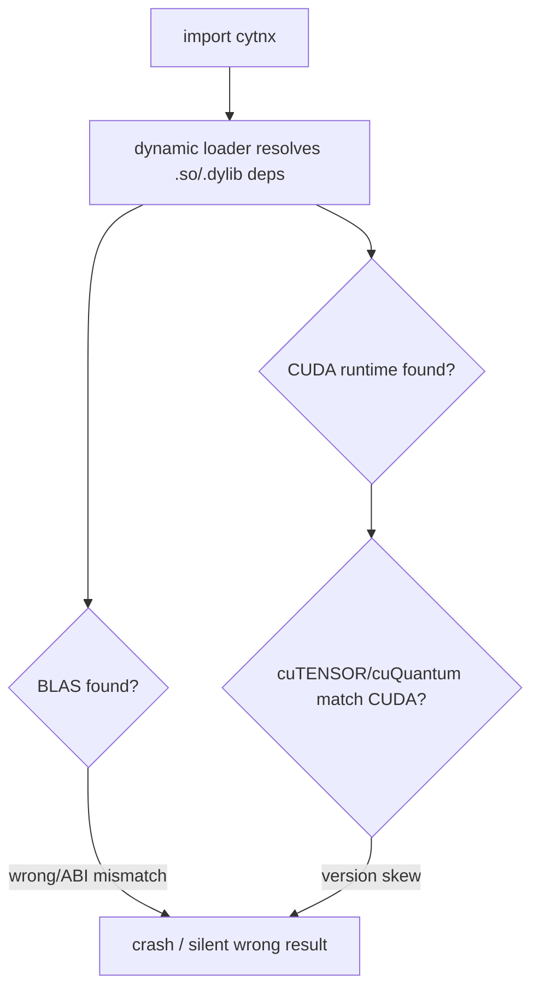

# Cytnx Deployment Analysis Implementation Plan

> **For agentic workers:** REQUIRED SUB-SKILL: Use superpowers:subagent-driven-development (recommended) or superpowers:executing-plans to implement this plan task-by-task. Steps use checkbox (`- [ ]`) syntax for tracking.

**Goal:** Produce a maintainer-facing analysis + strategy document (a GitHub repo of Markdown chapters) that audits how Cytnx ≥1.1.0 is deployed and recommends a better deployment strategy.

**Architecture:** A standalone repo `cytnx-deployment-analysis` with the Cytnx source pinned as a reference-only git submodule at the v1.1.0 tag. The document is organized layered / problem-first across seven chapters (`docs/00`–`06`): current-state audit → dependency taxonomy → build-time+import-time problems → SciPy/CuPy references → channel evaluation → recommendation/roadmap → executive summary (written last). Every current-state claim is cited to a specific submodule file or a published artifact.

**Tech Stack:** Markdown (GitHub-flavored), Mermaid diagrams (inline, renders on GitHub — no build tooling), git submodules, `gh`/`git`/`grep`/`curl` for evidence gathering and verification.

## Global Constraints

- Cytnx submodule lives at `external/Cytnx`, pinned to the **v1.1.0 tag** (a fixed commit), and is **reference-only** — never modified.
- Every claim about Cytnx's *current* behavior cites a specific file (with path, and line/section where possible) in `external/Cytnx/`, or a specific published artifact (PyPI / conda / anaconda / GitHub Actions run).
- Reference-project (SciPy, CuPy) claims are cited to their public build/packaging files or docs — named, transferable patterns, not generic praise.
- Libraries that MUST each be analyzed: **hptt, OpenBLAS (with MKL as the alternative), CUDA toolkit, cuTENSOR, cuQuantum, ARPACK, pybind11, Boost.** Note build-time-only deps (pybind11 header-only; Boost depends on components used) vs. runtime deps.
- Build-time discovery and import-time runtime resolution are told as **one story**.
- Platform coverage: **Linux + CUDA** (primary GPU story) and **macOS** (first-class CPU story: Apple Silicon/arm64, Accelerate vs OpenBLAS, hptt ARM variant, no-CUDA implication) are both first-class; **Windows** is noted where it materially differs, not deep-dived.
- Audience: **Cytnx maintainers** — chapters must be specific and actionable (a basis for issues/PRs/roadmap).
- Prototype deployment configs are **out of scope** — mentioned only as a marked follow-up phase in chapter 06.
- No placeholder text (`TODO`/`TBD`/`FIXME`) survives in any committed chapter.

## File Structure

| Path | Responsibility |
|------|----------------|
| `README.md` | What the repo is, how to read it, TL;DR of the recommendation (written in final task) |
| `LICENSE` | License for the analysis text |
| `.gitignore` | Ignore OS/editor cruft |
| `.gitmodules` | Submodule definition (created by `git submodule add`) |
| `external/Cytnx/` | Cytnx source, submodule pinned at v1.1.0 (reference-only) |
| `docs/00-executive-summary.md` | One-page recommendation + top changes (written last) |
| `docs/01-current-state-audit.md` | How Cytnx v1.1.0 builds and ships today, cited |
| `docs/02-dependency-taxonomy.md` | The 8 libraries classified by shipping difficulty + dependency-graph diagram |
| `docs/03-core-problems.md` | Build-time discovery + import-time resolution + resolution-flow diagram |
| `docs/04-reference-projects.md` | SciPy and CuPy playbooks, distilled to patterns |
| `docs/05-channel-evaluation.md` | Scoring matrix: source/pip/conda/pixi/uv |
| `docs/06-recommended-strategy.md` | Recommendation + phased roadmap + follow-up phase |

**Dependencies between tasks:** Task 1 (scaffold) → Task 2 (submodule) → Task 3 (ch01) → Task 4 (ch02) → Task 5 (ch03) → Task 7 (ch05). Task 6 (ch04 references) depends only on Task 1 and can be done any time after scaffolding. Task 7 depends on Tasks 5 and 6. Task 8 (ch06) depends on Task 7. Task 9 (ch00 + README) depends on all.

---

### Task 1: Repository scaffold

**Files:**
- Create: `README.md` (skeleton), `LICENSE`, `.gitignore`
- Create: `docs/` and `assets/` directories (placeholder `.gitkeep` in `assets/`)

**Interfaces:**
- Consumes: nothing (first task; repo already git-initialized with the spec/plan committed).
- Produces: the directory layout and a committed baseline every later task writes into.

- [ ] **Step 1: Write the acceptance check and run it (expect fail)**

Run:
```bash
test -f README.md && test -f LICENSE && test -f .gitignore && test -d docs && echo OK || echo MISSING
```
Expected: `MISSING`

- [ ] **Step 2: Create `.gitignore`**

```gitignore
.DS_Store
*.swp
.idea/
.vscode/
__pycache__/
```

- [ ] **Step 3: Create `LICENSE`**

Use CC-BY-4.0 for the analysis text (it is prose, not code). Fetch the canonical text:
```bash
curl -fsSL https://raw.githubusercontent.com/licenses/license-templates/master/templates/cc-by-4.0.txt -o LICENSE || \
  printf 'Creative Commons Attribution 4.0 International (CC BY 4.0)\nhttps://creativecommons.org/licenses/by/4.0/legalcode\n' > LICENSE
```
Expected: `LICENSE` exists and is non-empty.

- [ ] **Step 4: Create `README.md` skeleton**

```markdown
# cytnx-deployment-analysis

Analysis of how [Cytnx](https://github.com/Cytnx-dev/Cytnx) (>= 1.1.0) is
deployed today, and a recommended deployment strategy for the maintainers.

The Cytnx source is pinned as a reference-only submodule under `external/Cytnx`
(v1.1.0). This repo proposes; it does not modify Cytnx.

## How to read this

1. [Executive summary](docs/00-executive-summary.md)
2. [Current-state audit](docs/01-current-state-audit.md)
3. [Dependency taxonomy](docs/02-dependency-taxonomy.md)
4. [Core problems](docs/03-core-problems.md)
5. [Reference projects](docs/04-reference-projects.md)
6. [Channel evaluation](docs/05-channel-evaluation.md)
7. [Recommended strategy & roadmap](docs/06-recommended-strategy.md)

## Status

Analysis phase. Prototype deployment configs are a marked follow-up (see
chapter 06).
```

- [ ] **Step 5: Create empty docs dir and assets placeholder**

```bash
mkdir -p docs assets && touch assets/.gitkeep
```

- [ ] **Step 6: Run acceptance check (expect pass)**

Run:
```bash
test -f README.md && test -f LICENSE && test -f .gitignore && test -d docs && echo OK || echo MISSING
```
Expected: `OK`

- [ ] **Step 7: Commit**

```bash
git add README.md LICENSE .gitignore assets/.gitkeep
git commit -m "chore: scaffold cytnx-deployment-analysis repo"
```

---

### Task 2: Pin Cytnx as a reference submodule

**Files:**
- Create: `.gitmodules`, `external/Cytnx/` (submodule)

**Interfaces:**
- Consumes: repo scaffold from Task 1.
- Produces: `external/Cytnx/` checked out at the v1.1.0 tag commit — the primary evidence source cited by Tasks 3–5.

- [ ] **Step 1: Acceptance check (expect fail)**

Run:
```bash
git submodule status 2>/dev/null | grep -q Cytnx && echo OK || echo MISSING
```
Expected: `MISSING`

- [ ] **Step 2: Add the submodule**

```bash
git submodule add https://github.com/Cytnx-dev/Cytnx.git external/Cytnx
```

- [ ] **Step 3: Check out the v1.1.0 tag and record the exact commit**

```bash
git -C external/Cytnx fetch --tags --depth 1 origin
git -C external/Cytnx checkout v1.1.0
git -C external/Cytnx rev-parse HEAD
```
Expected: a 40-char commit hash prints. **Record it** — cite this commit in chapter 01. If `v1.1.0` is not a tag, run `git -C external/Cytnx tag -l 'v1.1*'` and use the newest 1.1.x tag; note the substitution in chapter 01.

- [ ] **Step 4: Confirm key build files are present for later citation**

```bash
ls external/Cytnx/CMakeLists.txt external/Cytnx/pyproject.toml external/Cytnx/CMakePresets.json && \
ls -d external/Cytnx/conda_build external/Cytnx/.github/workflows
```
Expected: all paths listed without error.

- [ ] **Step 5: Acceptance check (expect pass)**

Run:
```bash
git submodule status | grep Cytnx
```
Expected: line starts with the recorded commit hash and shows `(v1.1.0)`.

- [ ] **Step 6: Commit**

```bash
git add .gitmodules external/Cytnx
git commit -m "chore: pin Cytnx v1.1.0 as reference-only submodule"
```

---

### Task 3: Chapter 01 — Current-state audit

**Files:**
- Create: `docs/01-current-state-audit.md`

**Interfaces:**
- Consumes: `external/Cytnx/` (Task 2).
- Produces: the factual baseline (build options, what CI ships, documented install paths) that chapters 02–06 reference.

- [ ] **Step 1: Acceptance check (expect fail)**

Run: `test -f docs/01-current-state-audit.md && echo OK || echo MISSING`
Expected: `MISSING`

- [ ] **Step 2: Gather build-system evidence from the submodule**

Read and note file paths + line numbers for each fact:
```bash
grep -n -E "option\(|USE_CUDA|USE_MKL|USE_HPTT|USE_CUTENSOR|USE_CUQUANTUM|BUILD_PYTHON|BACKEND_TORCH|find_package|find_library|FetchContent|CUTENSOR_ROOT|CUQUANTUM_ROOT" external/Cytnx/CMakeLists.txt
sed -n '1,80p' external/Cytnx/pyproject.toml
cat external/Cytnx/CMakePresets.json
ls external/Cytnx/.github/workflows
```
For each `USE_*` option, record: name, default (ON/OFF), and what it gates.

- [ ] **Step 3: Gather distribution-reality evidence**

Read the CI workflows to determine what is actually built and published:
```bash
for f in external/Cytnx/.github/workflows/*; do echo "== $f =="; grep -n -E "cibuildwheel|manylinux|upload|pypi|conda|twine|cuda|matrix|python-version|os:" "$f"; done
cat external/Cytnx/conda_build/*/meta.yaml 2>/dev/null || ls -R external/Cytnx/conda_build
```
Then check published artifacts (state what exists, with the URL as citation):
```bash
curl -fsSL https://pypi.org/pypi/cytnx/json | python3 -c "import sys,json; d=json.load(sys.stdin); print('latest', d['info']['version']); print('files', [f['filename'] for r in d['releases'].values() for f in r][:20])" 2>/dev/null || echo "no PyPI 'cytnx' project"
```
Record whether wheels exist, for which platforms/Python/CUDA, and whether a conda package is published.

- [ ] **Step 4: Write the chapter**

Write `docs/01-current-state-audit.md` with these sections, each backed by the citations gathered above:
```markdown
# 01 — Current-State Audit

Reference commit: Cytnx `v1.1.0` (`<recorded-hash>`).

## 1.1 Build system
- CMake entry points and what they do (`CMakeLists.txt`, `CytnxBKNDCMakeLists.cmake`, `CMakePresets.json`, `version.cmake`).
- The `USE_*` option matrix — a table: option | default | gates what | how the dep is located.

## 1.2 What CI builds and publishes
- Per workflow: trigger, platform/python/CUDA matrix, artifact produced, publish target. Cite file + line.
- Table: platform × Python × CUDA → wheel? conda? source-only?

## 1.3 Documented install paths for users
- pip / conda / build-from-source, as a user would find them. Cite README/docs.

## 1.4 Gaps observed (facts only)
- Where "the build can do X" but "CI does not ship X". No recommendations yet.
```
Every bullet that states current behavior ends with a citation like `(external/Cytnx/CMakeLists.txt:NN)` or a URL.

- [ ] **Step 5: Verify citations and coverage**

Run:
```bash
grep -c "external/Cytnx/" docs/01-current-state-audit.md   # expect >= 8 citations
grep -E -o "USE_CUDA|USE_MKL|USE_HPTT|USE_CUTENSOR|USE_CUQUANTUM|BUILD_PYTHON|BACKEND_TORCH" docs/01-current-state-audit.md | sort -u | wc -l   # expect 7
! grep -n -E "TODO|TBD|FIXME" docs/01-current-state-audit.md && echo "no placeholders"
```
Expected: citation count ≥ 8, option count = 7, `no placeholders`.

- [ ] **Step 6: Commit**

```bash
git add docs/01-current-state-audit.md
git commit -m "docs: add chapter 01 current-state audit"
```

---

### Task 4: Chapter 02 — Dependency taxonomy

**Files:**
- Create: `docs/02-dependency-taxonomy.md`

**Interfaces:**
- Consumes: chapter 01 build facts; `external/Cytnx/`.
- Produces: per-library profiles (build vs runtime, ABI, redistribution, existing packages) that chapter 03 problems and chapter 05 scoring build on.

- [ ] **Step 1: Acceptance check (expect fail)**

Run: `test -f docs/02-dependency-taxonomy.md && echo OK || echo MISSING`
Expected: `MISSING`

- [ ] **Step 2: Confirm each library's build-system evidence**

```bash
grep -n -E "hptt|HPTT|OpenBLAS|BLAS|LAPACK|MKL|CUDA|cutensor|CUTENSOR|cuquantum|CUQUANTUM|arpack|ARPACK|pybind11|Boost|BOOST" external/Cytnx/CMakeLists.txt external/Cytnx/CytnxBKNDCMakeLists.cmake
```
Record, per library, how it is located (find_package / find_library / env var / FetchContent) and whether it is required or optional.

- [ ] **Step 3: Write the chapter with one profile per library**

Write `docs/02-dependency-taxonomy.md`. Include a **summary table** and a **per-library profile** for each of: hptt, OpenBLAS, MKL, CUDA toolkit, cuTENSOR, cuQuantum, ARPACK, pybind11, Boost.
```markdown
# 02 — Dependency Taxonomy

## 2.1 Summary table
| Library | Role | Build-time discovery | Runtime lib? | ABI/version constraints | Redistribution | PyPI wheel? | conda-forge? | Shipping difficulty |
|---|---|---|---|---|---|---|---|---|

## 2.2 Per-library profiles
### hptt
- Role; how Cytnx finds it (cite); runtime resolution; ARM/AVX/IBM variants; macOS arm64 note; packaging availability.
### OpenBLAS  (### MKL as alternative)
### CUDA toolkit
### cuTENSOR   (env var CUTENSOR_ROOT — cite)
### cuQuantum  (env var CUQUANTUM_ROOT — cite)
### ARPACK     (compiled runtime dep — cite find_library)
### pybind11    (header-only, build-time only, FetchContent — cite)
### Boost       (components used; header-only vs compiled — cite)

## 2.3 Classification
Group the libraries into: (a) CPU math, (b) GPU stack, (c) build-only. State
which are the hard-to-ship ones and why (redistribution, per-CUDA-version, ABI).
```

- [ ] **Step 4: Verify all libraries covered and no placeholders**

Run:
```bash
for L in hptt OpenBLAS MKL "CUDA toolkit" cuTENSOR cuQuantum ARPACK pybind11 Boost; do \
  grep -q "$L" docs/02-dependency-taxonomy.md && echo "OK $L" || echo "MISSING $L"; done
! grep -n -E "TODO|TBD|FIXME" docs/02-dependency-taxonomy.md && echo "no placeholders"
```
Expected: `OK` for all 9 rows, `no placeholders`.

- [ ] **Step 5: Commit**

```bash
git add docs/02-dependency-taxonomy.md
git commit -m "docs: add chapter 02 dependency taxonomy"
```

---

### Task 5: Chapter 03 — Core problems (build-time + import-time)

**Files:**
- Create: `docs/03-core-problems.md`

**Interfaces:**
- Consumes: chapters 01–02.
- Produces: the problem statement (with a Mermaid resolution-flow diagram) that chapters 04–06 answer.

- [ ] **Step 1: Acceptance check (expect fail)**

Run: `test -f docs/03-core-problems.md && echo OK || echo MISSING`
Expected: `MISSING`

- [ ] **Step 2: Write the chapter**

Write `docs/03-core-problems.md`:
```markdown
# 03 — Core Problems (one story)

## 3.1 Build-time discovery
- Inconsistency: `find_package` vs `find_library` vs env-var (`CUTENSOR_ROOT`,
  `CUQUANTUM_ROOT`) — cite chapter 02 rows. Why this hurts reproducibility.
- Platform angle: Linux/CUDA vs macOS (Accelerate, arm64), Windows (where it differs).

## 3.2 Import-time runtime resolution
- What happens at `import cytnx`: how the compiled extension finds its native
  libs (RPATH / LD_LIBRARY_PATH / bundled vs system). Cite build flags that set
  RPATH if any.
- Failure modes: wrong lib found, ABI mismatch, GPU driver/toolkit skew,
  pip-vs-conda lib conflicts. One concrete failing scenario per mode.

## 3.3 The connection
- Why build-time choices determine import-time fragility — the single story.

## 3.4 Import-time resolution flow (diagram)

(Adjust the diagram to the actual resolved facts.)
```

- [ ] **Step 3: Verify both problems present, diagram present, no placeholders**

Run:
```bash
grep -q "Build-time" docs/03-core-problems.md && grep -q "import-time\|Import-time" docs/03-core-problems.md && echo "both problems"
grep -q '```mermaid' docs/03-core-problems.md && echo "diagram present"
! grep -n -E "TODO|TBD|FIXME" docs/03-core-problems.md && echo "no placeholders"
```
Expected: `both problems`, `diagram present`, `no placeholders`.

- [ ] **Step 4: Commit**

```bash
git add docs/03-core-problems.md
git commit -m "docs: add chapter 03 core problems"
```

---

### Task 6: Chapter 04 — Reference projects (SciPy, CuPy)

**Files:**
- Create: `docs/04-reference-projects.md`

**Interfaces:**
- Consumes: chapter 03 problem framing (to answer the same problems).
- Produces: named, transferable patterns consumed by chapters 05–06. Independent of Tasks 3–5; needs only Task 1.

- [ ] **Step 1: Acceptance check (expect fail)**

Run: `test -f docs/04-reference-projects.md && echo OK || echo MISSING`
Expected: `MISSING`

- [ ] **Step 2: Gather SciPy evidence**

Consult and cite (URLs): SciPy's build system (Meson), BLAS/LAPACK handling, and wheel/manylinux bundling (`auditwheel`, `delocate` for macOS). Suggested sources:
- `https://github.com/scipy/scipy/blob/main/pyproject.toml`
- SciPy "building from source" / "distributing" docs and `tools/wheels/`.
Note how they select BLAS at build, and how they bundle/repair libs into wheels per-platform (Linux `auditwheel`, macOS `delocate`).

- [ ] **Step 3: Gather CuPy evidence**

Consult and cite (URLs): CuPy's per-CUDA-version wheel scheme (`cupy-cuda11x`, `cupy-cuda12x`), how it locates the CUDA runtime, and its optional cuTENSOR/cuQuantum/cuDNN handling (`cupy.cuda` install helpers). Suggested sources:
- `https://github.com/cupy/cupy` `setup.py`/`install/` and the CuPy install docs.
Note how CuPy avoids bundling the full CUDA toolkit and how it ships optional accelerators.

- [ ] **Step 4: Write the chapter as patterns mapped to chapter 03 problems**

Write `docs/04-reference-projects.md`:
```markdown
# 04 — Reference Projects

## 4.1 SciPy — the BLAS / manylinux wheel-bundling playbook
- Pattern S1: build-time BLAS selection (cite).
- Pattern S2: wheel repair/bundling per platform — auditwheel (Linux) / delocate (macOS) (cite).
- What transfers to Cytnx's OpenBLAS/ARPACK/hptt story.

## 4.2 CuPy — the CUDA-runtime / per-CUDA-version wheel playbook
- Pattern C1: per-CUDA-version wheels instead of one fat wheel (cite).
- Pattern C2: locate CUDA runtime without bundling the toolkit (cite).
- Pattern C3: optional accelerators (cuTENSOR/cuQuantum) as add-ons (cite).
- What transfers to Cytnx's CUDA/cuTENSOR/cuQuantum story.

## 4.3 Pattern → problem map
Table: each pattern (S1..C3) → which chapter-03 problem it addresses.
```

- [ ] **Step 5: Verify both projects, patterns, and citations present**

Run:
```bash
grep -qi "scipy" docs/04-reference-projects.md && grep -qi "cupy" docs/04-reference-projects.md && echo "both refs"
grep -c "http" docs/04-reference-projects.md   # expect >= 4 citations
grep -qi "auditwheel\|delocate" docs/04-reference-projects.md && grep -qi "cuda11\|cuda12\|per-CUDA" docs/04-reference-projects.md && echo "key patterns present"
! grep -n -E "TODO|TBD|FIXME" docs/04-reference-projects.md && echo "no placeholders"
```
Expected: `both refs`, citation count ≥ 4, `key patterns present`, `no placeholders`.

- [ ] **Step 6: Commit**

```bash
git add docs/04-reference-projects.md
git commit -m "docs: add chapter 04 reference projects"
```

---

### Task 7: Chapter 05 — Channel evaluation

**Files:**
- Create: `docs/05-channel-evaluation.md`

**Interfaces:**
- Consumes: chapters 02 (deps), 03 (problems), 04 (patterns).
- Produces: a scored matrix and a single leading recommendation consumed by chapter 06.

- [ ] **Step 1: Acceptance check (expect fail)**

Run: `test -f docs/05-channel-evaluation.md && echo OK || echo MISSING`
Expected: `MISSING`

- [ ] **Step 2: Write the chapter**

Write `docs/05-channel-evaluation.md`. Score each channel on each criterion (e.g. ✅ / ⚠️ / ❌ with a one-line justification referencing chapters 02–04):
```markdown
# 05 — Channel Evaluation

## 5.1 Criteria
Dependency coverage · GPU support · runtime-resolution robustness ·
reproducibility · maintainer burden · user experience.

## 5.2 Matrix
| Channel | Dep coverage | GPU | Runtime robustness | Reproducibility | Maintainer burden | UX |
|---|---|---|---|---|---|---|
| build-from-source | | | | | | |
| pip / wheels | | | | | | |
| conda(-forge) | | | | | | |
| pixi | | | | | | |
| uv | | | | | | |

Each cell: rating + one-line justification citing a chapter-02/03/04 finding.

## 5.3 Platform notes
- Linux+CUDA vs macOS (arm64/Accelerate, no CUDA) per channel; Windows where it differs.

## 5.4 Leading option
State which channel(s) score best and why — the input to chapter 06.
```

- [ ] **Step 3: Verify all channels and criteria present**

Run:
```bash
for C in "build-from-source" "pip" "conda" "pixi" "uv"; do grep -qi "$C" docs/05-channel-evaluation.md && echo "OK $C" || echo "MISSING $C"; done
grep -qi "maintainer burden" docs/05-channel-evaluation.md && grep -qi "runtime" docs/05-channel-evaluation.md && echo "criteria present"
! grep -n -E "TODO|TBD|FIXME" docs/05-channel-evaluation.md && echo "no placeholders"
```
Expected: `OK` for all 5 channels, `criteria present`, `no placeholders`.

- [ ] **Step 4: Commit**

```bash
git add docs/05-channel-evaluation.md
git commit -m "docs: add chapter 05 channel evaluation"
```

---

### Task 8: Chapter 06 — Recommended strategy + roadmap

**Files:**
- Create: `docs/06-recommended-strategy.md`

**Interfaces:**
- Consumes: chapter 05 leading option (and 02–04).
- Produces: the recommendation and a phased, issue-ready roadmap; defines the follow-up prototype phase.

- [ ] **Step 1: Acceptance check (expect fail)**

Run: `test -f docs/06-recommended-strategy.md && echo OK || echo MISSING`
Expected: `MISSING`

- [ ] **Step 2: Write the chapter**

Write `docs/06-recommended-strategy.md`:
```markdown
# 06 — Recommended Strategy & Roadmap

## 6.1 Recommendation
The recommended primary channel + fallback, justified from chapter 05, in 1–2
paragraphs. Explicit on Linux+CUDA and macOS.

## 6.2 The 2–3 highest-impact changes
Numbered, each phrased so a maintainer could open it as an issue:
1. <change> — why (cite chapter) — rough effort.
2. ...

## 6.3 Phased roadmap
- Phase 1: <build-time discovery cleanup> — concrete steps.
- Phase 2: <packaging/wheels or conda> — concrete steps.
- Phase 3: <GPU accelerators> — concrete steps.
Each phase: what changes, which files in Cytnx, acceptance signal.

## 6.4 Follow-up phase (out of scope here)
Prototype configs (pixi.toml / conda recipe / pip-uv wheels) that VALIDATE this
strategy — explicitly a later project, not built in this repo.
```

- [ ] **Step 3: Verify recommendation, roadmap, follow-up present**

Run:
```bash
grep -qi "recommend" docs/06-recommended-strategy.md && grep -qi "phase" docs/06-recommended-strategy.md && grep -qi "follow-up\|out of scope" docs/06-recommended-strategy.md && echo "structure present"
! grep -n -E "TODO|TBD|FIXME" docs/06-recommended-strategy.md && echo "no placeholders"
```
Expected: `structure present`, `no placeholders`.

- [ ] **Step 4: Commit**

```bash
git add docs/06-recommended-strategy.md
git commit -m "docs: add chapter 06 recommended strategy and roadmap"
```

---

### Task 9: Chapter 00 executive summary + README finalization + link check

**Files:**
- Create: `docs/00-executive-summary.md`
- Modify: `README.md` (add TL;DR of the recommendation)

**Interfaces:**
- Consumes: all chapters 01–06.
- Produces: the one-page summary read first, and a verified, link-clean document set.

- [ ] **Step 1: Acceptance check (expect fail)**

Run: `test -f docs/00-executive-summary.md && echo OK || echo MISSING`
Expected: `MISSING`

- [ ] **Step 2: Write the executive summary**

Write `docs/00-executive-summary.md` (one page): the problem in 2 sentences, the recommendation (from ch06), the 2–3 highest-impact changes, and a pointer to the follow-up phase. Every claim links to the chapter that backs it (`[…](01-current-state-audit.md)` etc.).

- [ ] **Step 3: Add the TL;DR to README**

Insert a `## TL;DR` section in `README.md` (before `## How to read this`) with the one-sentence recommendation and a link to `docs/00-executive-summary.md`.

- [ ] **Step 4: Whole-document verification**

Run:
```bash
# All 7 chapters exist
ls docs/0{0,1,2,3,4,5,6}-*.md | wc -l    # expect 7
# No placeholders anywhere
! grep -rn -E "TODO|TBD|FIXME" docs/ README.md && echo "no placeholders"
# Internal doc links resolve (each docs/*.md link points to an existing file)
python3 - <<'PY'
import re, pathlib, sys
bad=[]
for md in pathlib.Path("docs").glob("*.md"):
    for m in re.finditer(r"\]\((?!https?:)([^)#]+\.md)", md.read_text()):
        target=(md.parent / m.group(1)).resolve()
        if not target.exists(): bad.append((str(md), m.group(1)))
for md in [pathlib.Path("README.md")]:
    for m in re.finditer(r"\]\((?!https?:)([^)#]+\.md)", md.read_text()):
        target=(md.parent / m.group(1)).resolve()
        if not target.exists(): bad.append((str(md), m.group(1)))
print("broken links:", bad or "none")
sys.exit(1 if bad else 0)
PY
# All 8 required libraries appear somewhere in the docs
for L in hptt OpenBLAS "CUDA" cuTENSOR cuQuantum ARPACK pybind11 Boost; do grep -rqi "$L" docs/ && echo "OK $L" || echo "MISSING $L"; done
```
Expected: chapter count `7`, `no placeholders`, `broken links: none`, `OK` for all 8 libraries.

- [ ] **Step 5: Commit**

```bash
git add docs/00-executive-summary.md README.md
git commit -m "docs: add executive summary and finalize README"
```

---

## Self-Review

**Spec coverage** (every spec requirement → task):
- Repo + reference-only submodule at v1.1.0 → Tasks 1–2. ✅
- Chapters 00–06 (layered structure) → Tasks 3–9. ✅
- All 8 libraries (hptt, OpenBLAS/MKL, CUDA, cuTENSOR, cuQuantum, ARPACK, pybind11, Boost) → Task 4 profiles + Task 9 coverage check. ✅
- Build-time + import-time as one story → Task 5. ✅
- SciPy + CuPy references → Task 6. ✅
- Channel evaluation (source/pip/conda/pixi/uv) → Task 7. ✅
- Maintainer roadmap + follow-up marked out of scope → Task 8. ✅
- Platform focus (Linux+CUDA + macOS first-class, Windows noted) → Global Constraints, enforced in Tasks 3/5/7 platform notes. ✅
- Citations to submodule/artifacts → verification steps in Tasks 3, 4, 6. ✅
- Diagrams (dependency graph, resolution flow) → dependency graph in Task 4 (§2), Mermaid resolution flow in Task 5. ✅

**Placeholder scan:** the `TODO/TBD` tokens appearing in verification `grep` commands are intentional (they check the *chapters* are placeholder-free), not plan placeholders. No unfilled plan steps. ✅

**Type/name consistency:** file paths (`docs/NN-*.md`), the recorded submodule commit, and the 8-library list are used identically across tasks and the final coverage check. ✅
